<table>
  <tr>
    <td valign="top" width="50%">
      <pre>                                                                        
                                    717    
                           000000000000000007
                      00008886885808051560000000990000                       
                    7085880668240089900000000000998080005                    
                   00032000400000000009969000000000660000003                 
                  0098994940047237             77300909490990                
                 004004600037                      6000096660                
                 036900027                           10008420                
                000005                                  000920               
               00907                                     40000               
               008                                        7860               
              004                                          6600              
              09                                           74000             
              05                               208451       3590             
             047                          7800002261 727    68607            
             055     190000000087          7                 1580            
             064    77         121       77                  3690            
             067   7             727    77  76200000003      5650            
             047     75000000 61  77     7  7   395  541     7860            
             043    700  006    7  7                         3000            
             002    713     7     77                          00  7966       
             003                  7                           2  43   2      
          3   02                 7                              7     7      
         466  91                                               96     1      
         7 247                                                               
         7   717               7742    1000813                      77       
         7    65               600008448577909                 1   77        
          7    7                  34982                       7              
          17   7   7                                         7               
           1  762                                            37              
           7    77               777131771149800097         7                
            7    57777       50086457713                    7                
                   1                                       1                 
                   57 77             77777                 1                 
                    27 777            77777                7                 
                     47 777  77777                         2                 
                      577 7                              712                 
                      5  77                           7131 1                 
                      35   7                        71227  7                 
                       63331117                  7152337   7                 
                       67713335457            15442331     7                 
                       4 7771111146988889698896211117       7                
                       3   7777117771111177777771117        7                
                       2     771177777771117777777           7               
                       2       777771177  77777              77              
                       1        777 77                         77 97         
                      77                                         70006       
                 03 777                                         0096800000   
               00                                             00086644680000
              </pre>
    </td>
    <td valign="top" width="50%">
      <h3>🧑‍💻 Hola, soy Richard Cedeño 🚀</h3>
      
¡Conecta conmigo también en mi LinkedIn! <strong>@rcaurasma</strong>

<strong> Áreas de conocimiento: </strong>

      <h3>Educación y Certificaciones</h3>
      <ul>
        <li><strong>Especialización en Desarrollo Inicial de Aplicaciones</strong>, 2025</li>
        <li><strong>Especialización en Desarrollo Full Stack</strong>, 2025</li>
        <li><strong>Especialización en Infraestructura TI Segura</strong>, 2025</li>
        <li><strong>INACAP, La Serena, Chile</strong>  Cursando quinto semestre de Ingeniería Informática, 2024 – Presente</li>
        <li><strong>Certificado Google AI Essentials V1</strong></li>
        <li><strong>EN PROGRESO: Certificado de Ciberseguridad Google</strong></li>
        <li><strong>Tres veces Mentor guía en Technovation Girls Chile. https://technovation.cl/ </strong></li>
        <li><strong>Inglés: Nivel avanzado (C1 según Oxford Online Placement Test)</strong></li>
      </ul>
    </td>
  </tr>
</table>

## 📱 PORTAFOLIO con páginas y aplicaciones (WORK IN PROGRESS)

  
<strong>1. Nuam Exchange - Mantenedor de Calificaciones Tributarias</strong>

  Descripción breve:
  > Aplicación web diseñada para digitalizar, centralizar y gestionar las calificaciones tributarias de instrumentos financieros y su información externa (factores y montos), reemplazando procesos manuales con herramientas de cargas masivas (CSV) y mantenedores CRUD. Participé como uno de los desarrolladores de front-end del equipo, implementé los diseños de UI/UX, corregí funcionalidades y asegurando el correcto funcionamiento de la aplicación y su posterior despliegue en AWS para la presentación final como técnico en informática.

  Tecnologías:
  - Front End: React 19, Vite, React Router DOM, CSS.
  - Back End: Node.js, Express, CORS.
  - Base de Datos: PostgreSQL
  
Tecnologías principales:

Frontend: React 19, Vite, React Router DOM, CSS nativo.
Backend: Node.js, Express, CORS.
Base de Datos: Configurada para funcionar de manera dual con PostgreSQL (para producción) o SQLite (para desarrollo/pruebas vía sqlite3).

  Enlaces:
  Enlaces:
  - Repositorio: [nuam-node-react](https://github.com/rcaurasma/nuam-node-react)

  Imágenes principales:
### Dashboard

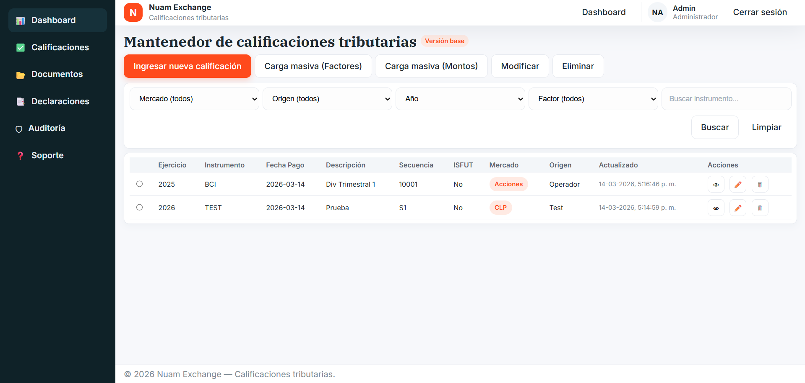

### Ingreso Manual de Calificación

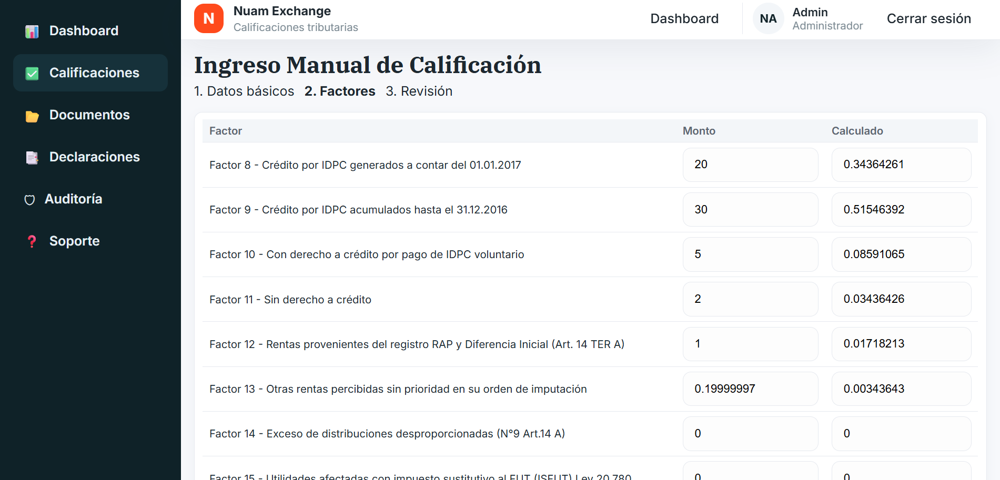

### Exportación / Vista de impresión (PDF)

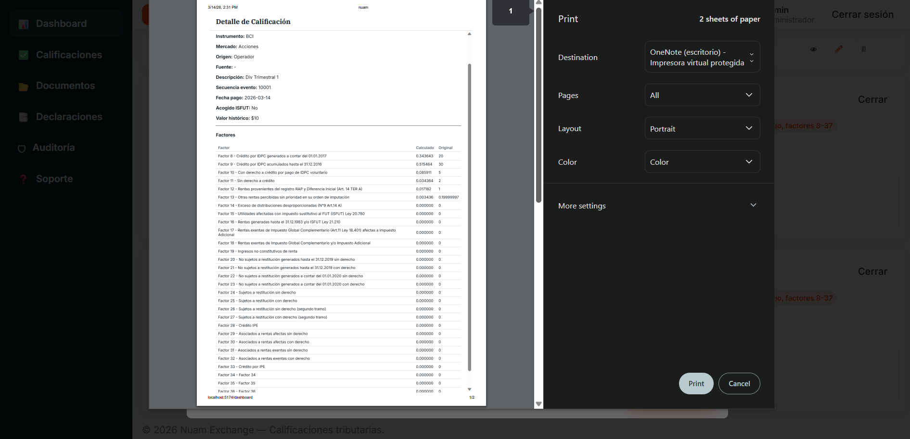

  
<strong>6. Veterinaria Django</strong>

  Descripción breve:
  > Aplicación web para gestión de una clínica veterinaria: manejo de citas, fichas médicas, roles de usuario (dueño, secretaria, veterinario, administrador) y CRUD de mascotas y productos.

  Tecnologías principales:
  - **Backend:** Python + Django
  - **Base de datos:** SQLite (db.sqlite3)
  - **Frontend:** HTML (plantillas Django), CSS y Bootstrap 5

  Enlaces:
  - Repositorio: (añade aquí la URL del repo si la tienes)

  Imágenes:
  ### Login

  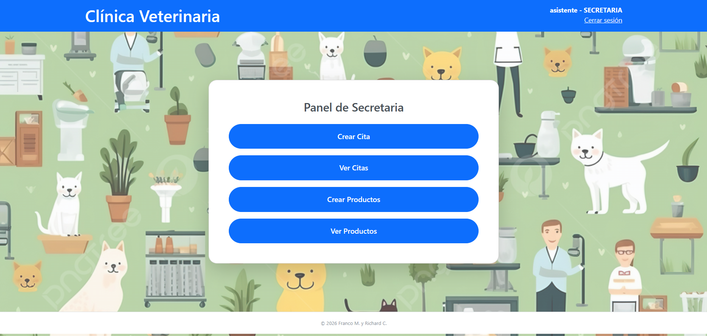

  ### Panel Admin / Dashboard (Dueño / Admin)

  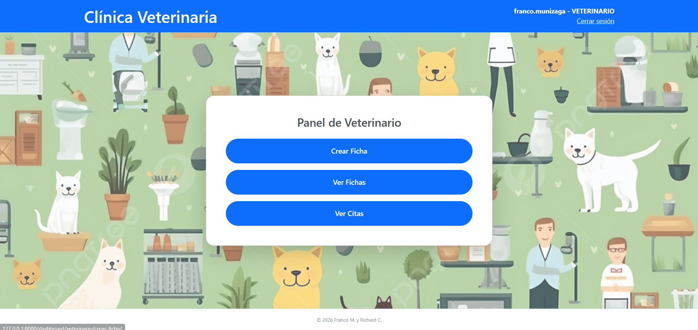

  ### Panel Secretaria

  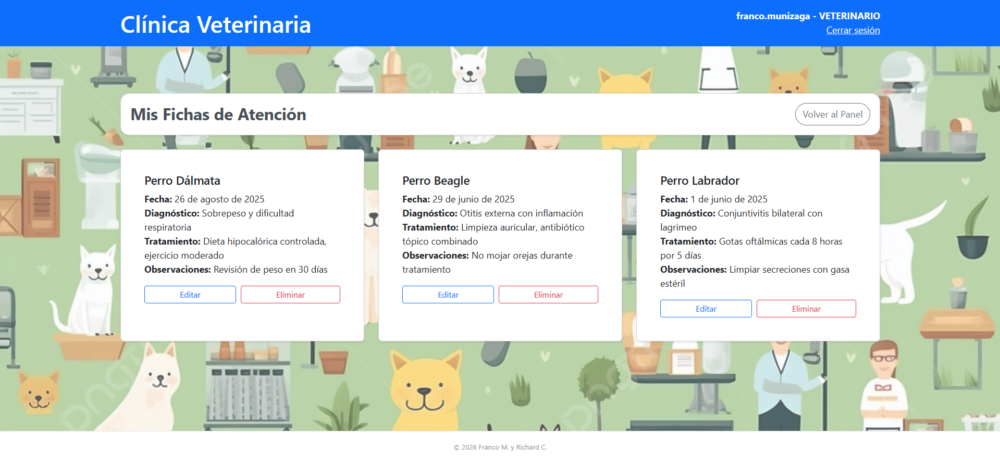

  ### Panel Veterinario

  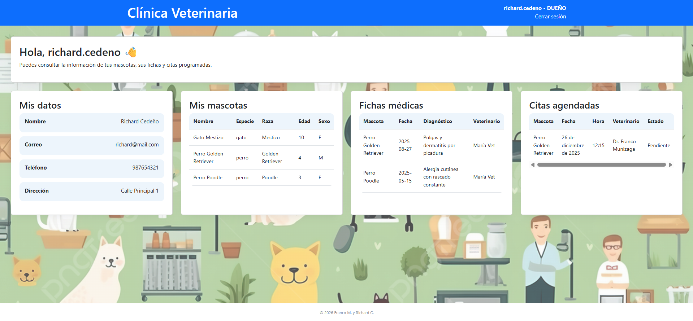

  ### Lista de Citas

  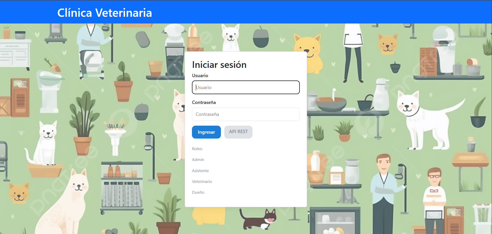

  ### Mis Fichas de Atención (Dueño)

  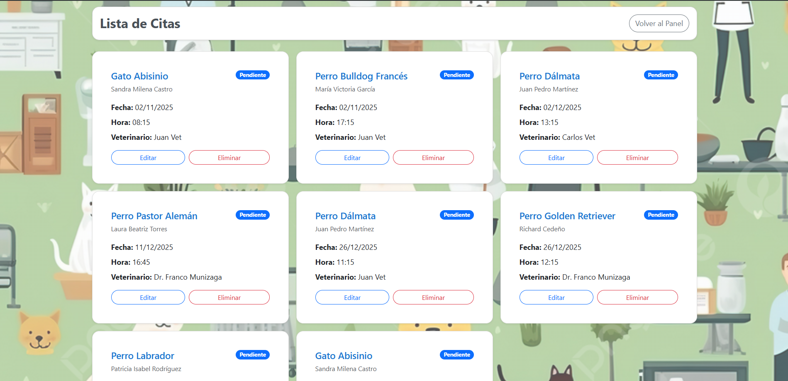

  
<strong>2. CuidadorApp: Plataforma de Gestión de Acompañantes Terapeúticos</strong>

  Descripción breve:
  > Como desarrollador full stack, junto con mi equipo en No Country, desarrollamos una solución innovadora dentro de la vertical de Web App Development, Mobile Development, enfocada en el sector Healthtech. Logramos integrar nuestras habilidades para resolver un desafío real con impacto. La experiencia destacó la colaboración, el aprendizaje y la aplicación práctica de conocimientos técnicos en un entorno simulado de trabajo.

  Tecnologías:
  - **frontend/** → Aplicación web construida con React + Vite + Material UI.  

  - **backend-flask/** → API construida con Flask (para demo) y preparada para migración a PostgreSQL.

  Enlaces:
  - Repositorio: [cuidadorapp-repo](https://github.com/No-Country-simulation/CuidadorApp_MonoRepo) <!-- cambia por la URL real -->
  - Demo: [Showcase y video de youtube](https://nocountry.tech/simulacion-laboral-febrero-2026/cml1xj4eq0011i4013opu06bx)

  Imágenes:
### Login

### Vista de administrador

### Administrador Gestion de pacientes

### Vista de cuidador

### Cuidador Registro de Turnos

### Cuidador Pagos

### Vista de familia o cliente

### Familia Solicitud de Atención

### Familia Historial Médico

### Familia Ventana de Soporte

  
<strong>3. EcoFood Landing Page</strong>

  Descripción breve:
  > Landing page informativa de EcoFood enfocada en comunicar la propuesta de valor para reducir el desperdicio de alimentos, presentar beneficios y facilitar la navegación hacia secciones clave del proyecto.

  Tecnologías principales:
  - **Frontend:** HTML y CSS

  Enlaces:
  - Repositorio: [ecofood-landingpage-repo](./) <!-- cambia por la URL real -->
  - Demo: (añade aquí la URL de la demo si la tienes)

  Imágenes:
  

    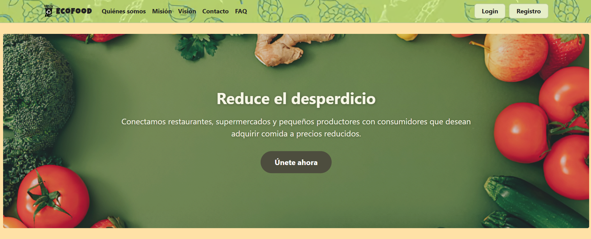
    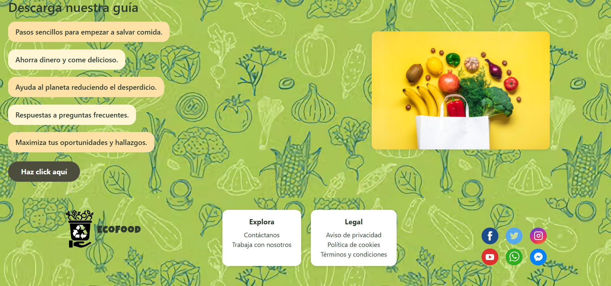
  

  
<strong>4. EcoFood App</strong>

  Descripción breve:
  > Aplicación web desarrollada con JavaScript y React que permite gestionar pedidos para ayudar a reducir el desperdicio de alimentos, conectando oferta disponible con usuarios interesados en comprar de forma responsable.

  Tecnologías principales:
  - **Frontend:** JavaScript y React

  Enlaces:
  - Repositorio: [ecofood-app-repo](./) <!-- cambia por la URL real -->
  - Demo: (añade aquí la URL de la demo si la tienes)

  Imágenes:
  

    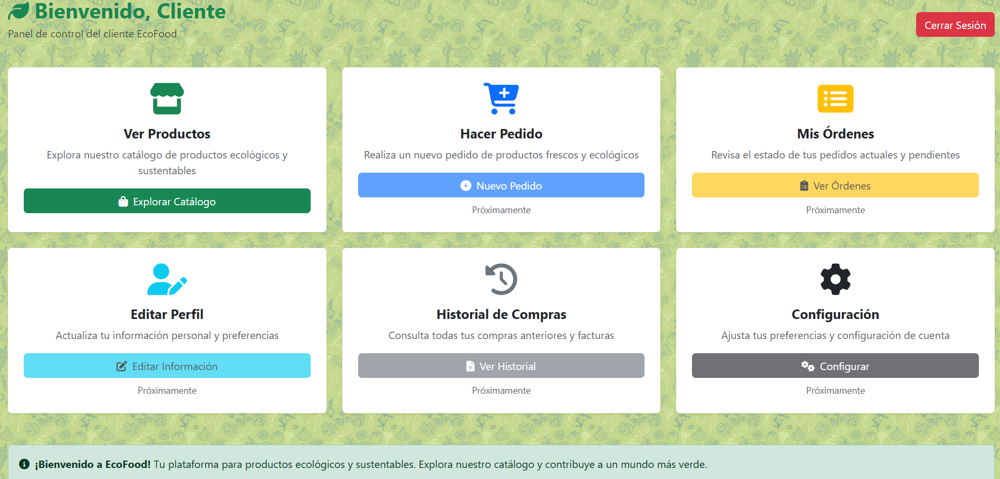
    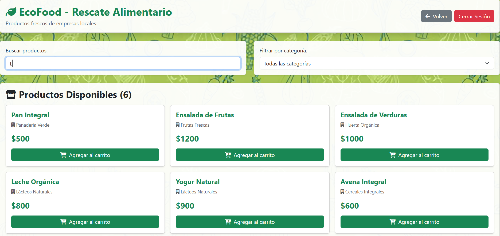
    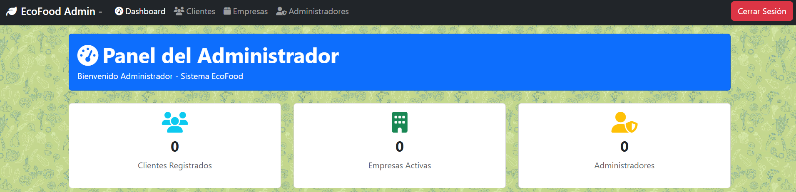
  

  
<strong>5. Bandas</strong>

  Descripción breve:
  > Catalogo web musical que permite a los usuarios explorar bandas, álbumes y canciones. Implementé la estructura de datos, las vistas y las plantillas para mostrar listados y fichas de detalle.

  Tecnologías principales usadas:
  - **Backend:** Python + Django
  - **Base de datos:** SQLite (db.sqlite3)
  - **Frontend:** HTML, CSS y Bootstrap 5 

  Enlaces:
  - Repositorio: [bandas-repo](https://github.com/rcaurasma/DJANGO-Bandas-Populares) <!-- cambia por la URL real -->

  Imágenes:
  

    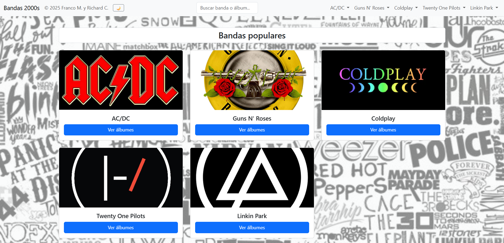
    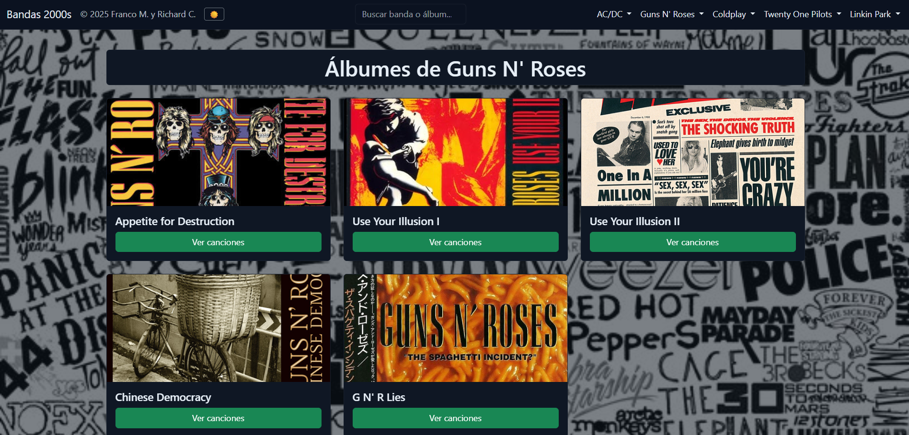
    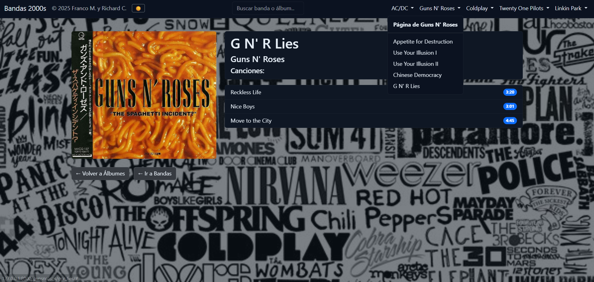
  

